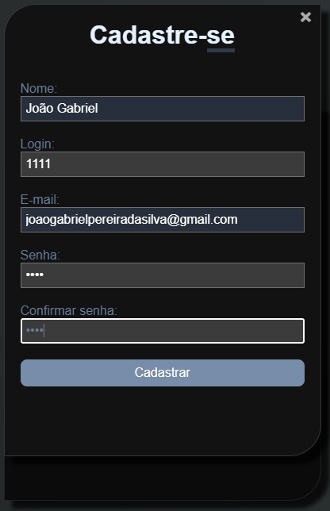
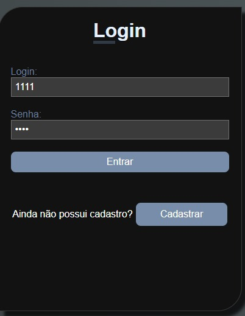
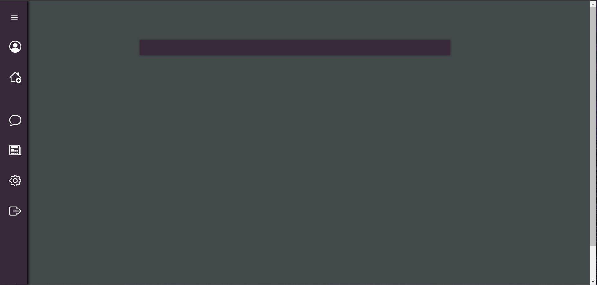
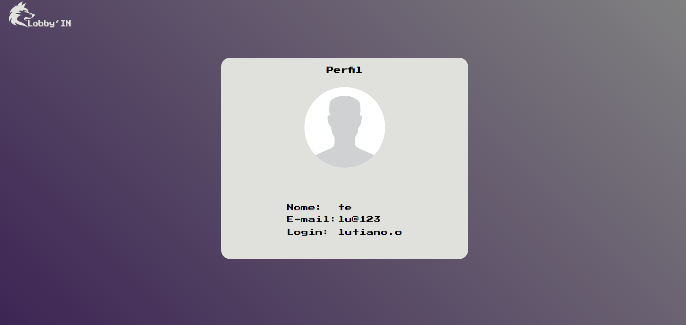
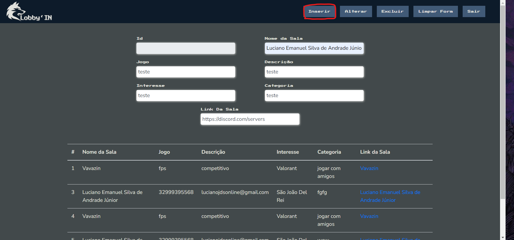
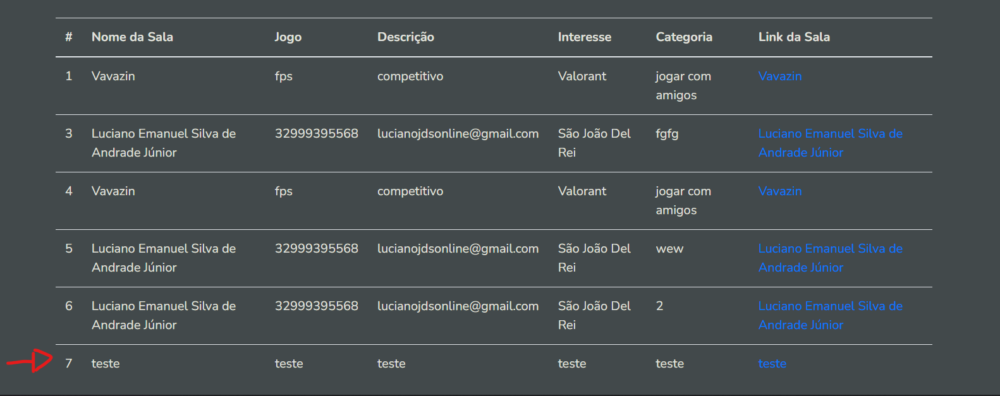
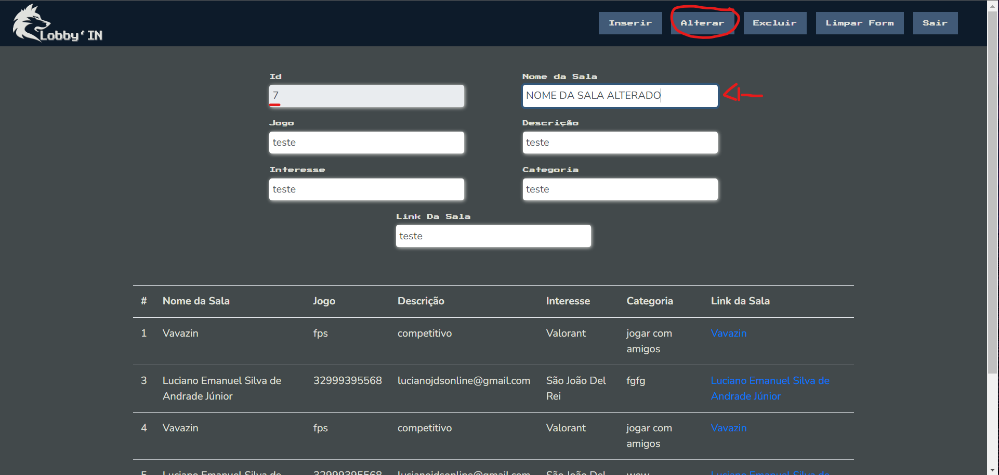
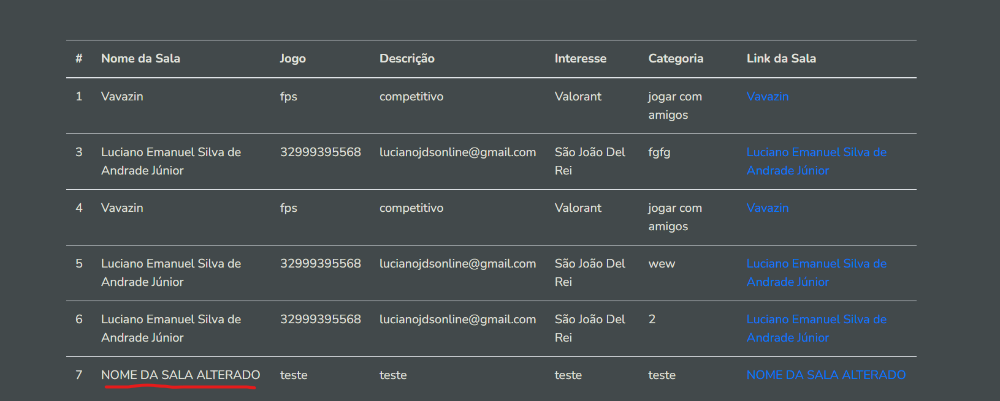
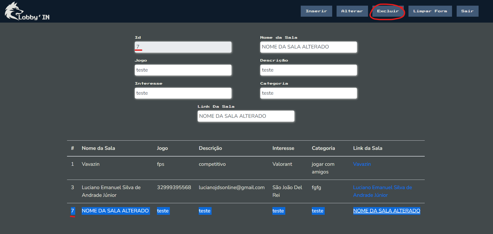
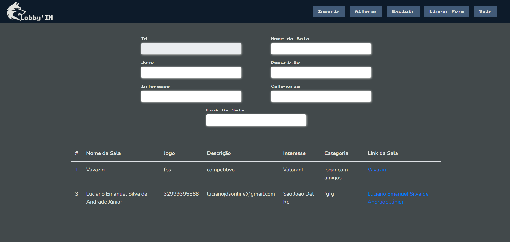

# Registro de Testes de Software

Pré-requisitos: <a href="3-Projeto de Interface.md"> Projeto de Interface</a>, <a href="8-Plano de Testes de Software.md"> Plano de Testes de Software</a>

Relatório com as evidências dos testes de software realizados no sistema pela equipe, baseado em um plano de testes pré-definido.

## Registro Testes login

Resultado: Após realizar o cadastro e em seguida o login, é feito o encaminhamento para tela inicial da aplicação.

## Registro Testes ao consultar usuário Usuário

Resultado: Após seguir pelo menu lateral e clicar em usuário, é feito o encaminhamento para tela de usuário e a exibição de suas informações básicas.

## Registro de Testes ao inserir

Resultado: Nova sala disponível

## Registro de Testes ao editar
Resultado: Sala alterada

## Registro de Testes ao excluir

Resultado: Sala excluída

## Avaliação

Inicialmente, verificamos que os testes correram de forma regular com o que foi proposto pelo grupo. Todavia, posteriormente, notamos que o sistema carece de uma robustez para verificar a validade de endereços de e-mail que são registrados por usuários. Também será objeto de tentativa de melhoria, no campo de validação do usuário quando do registro, o pedido para que o usuário digite a senha cadastrada duas vezes para fins de segurança. No mais, buscaremos aumentar a fluidez das transições e velocidade em geral do sistema.